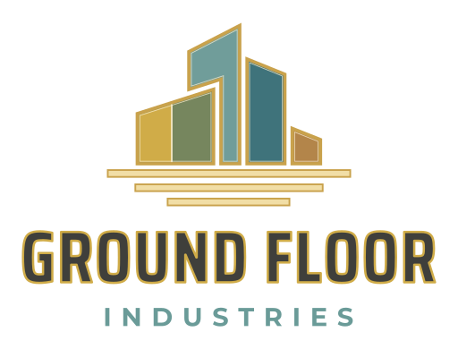
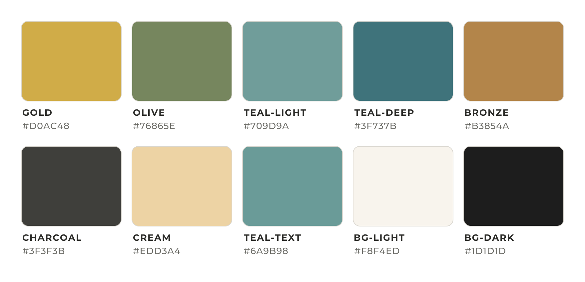

# Ground Floor Industries — Logo & Brand Assets

The official logo files for **Ground Floor Industries**, in one place so they can be pulled into any project, document, website, or print job.



All logos are **vector** masters (SVG and PDF), which scale to any size with no loss in quality: business cards, signs, vehicle wraps, embroidery. The PNGs are exported from those masters.

## Which file do I use?

| I need… | Use this |
|---|---|
| Website, email signature, slides, Word/Google Docs | `logos/png/` (2000px) or `logos/png/small/` (256–1024px) |
| Anything a print shop, sign maker, or designer asks for ("vector", "SVG", "PDF", "EPS", "AI") | `logos/pdf/` or `logos/svg/` |
| A horizontal logo for a header or letterhead | `gfi-horizontal-for-light-bg` / `…-for-dark-bg` |
| A centered logo (cover page, sign, banner) | `gfi-stacked-for-light-bg` / `…-for-dark-bg` |
| Just the building mark (profile picture, app icon, stamp) | `gfi-icon-for-light-bg` / `…-for-dark-bg` |
| The building mark under ~64px, embroidery, stamps, one-color jobs | `gfi-icon-simple-for-light-bg` / `…-for-dark-bg` (no hairline highlights) |
| The logo on its own cream or charcoal background | `…-light-with-background` / `…-dark-with-background` |
| Browser-tab / phone home-screen icons | `favicon/` |
| Brand colors | `colors/` (JSON, CSS, SCSS, swatch image) |
| The logo in a React / Next.js site | The npm package — see [React component library](#react-component-library) |
| All four logos on one page (to show a printer, designer, or partner) | `logos/sheet/gfi-logo-sheet.pdf` |

**"for-light-bg"** = charcoal wordmark with mustard-gold edge, transparent background; place it on white or cream.
**"for-dark-bg"** = cream wordmark, transparent background; place it on black or charcoal.

If a print shop asks for **EPS or AI**, send the PDF. Illustrator, CorelDRAW, and most sign-cutting software open it as editable vector artwork.

## Folder layout

```
LogoPack/
├── logos/
│   ├── svg/           # Vector masters (web + design tools)
│   ├── pdf/           # Vector masters (print shops, Illustrator)
│   ├── sheet/         # All four logos on one page (SVG, PDF, PNG)
│   └── png/           # 2000px exports (icons 1024px), transparent unless "with-background"
│       └── small/     # 64–1024px web-ready sizes
├── favicon/           # favicon.ico, favicon.svg, 16–512px PNGs, apple-touch-icon (from the simple icon)
├── colors/            # palette.json, palette.css, _palette.scss, swatches (SVG + PNG)
├── source/            # Original AI-generated logo sheet (historical reference only)
├── src/               # React component library (TypeScript)
│   ├── generated/     # Logo components + color tokens, generated from logos/svg and colors/palette.json
│   └── stories/       # Storybook stories
├── scripts/generate.mjs  # Regenerates src/generated from the vector masters
├── .storybook/        # Storybook configuration
├── .github/workflows/ # Publishes Storybook + the preview page to GitHub Pages on every push
├── package.json       # npm package: @groundfloorindustries/logopack
└── index.html         # Visual preview of everything (open in a browser)
```

## Design rules built into the mark

- **One roof pitch:** every roof uses the same ~22° angle, rising on the left buildings and falling on the right.
- **One gap:** the space between buildings, between the buildings and the foundation, and between the foundation bars is the same width.
- **One frame:** every panel, including the divider in the low building, has the same gold frame weight.
- **Horizontal lock-up:** "GROUND FLOOR" sits on the building baseline and "INDUSTRIES" sits on the bottom foundation bar.

## Typography

The lettering has been converted to outlines, so the logo files don't need any fonts installed. To match the logo in other materials, use these free Google Fonts:

| Element | Font | Settings |
|---|---|---|
| **GROUND FLOOR** wordmark | [Saira Condensed](https://fonts.google.com/specimen/Saira+Condensed), Bold (700) | All caps, letter-spacing +0.02em |
| **INDUSTRIES** tagline | [Montserrat](https://fonts.google.com/specimen/Montserrat), Bold (700) | All caps, letter-spacing +0.37em |

## Brand colors



| Name | Hex | Where it appears |
|---|---|---|
| Deep teal | `#1F5C5B` | Right tower; INDUSTRIES tagline on light backgrounds; primary accent |
| Evergreen | `#355E4B` | Second panel of the low building |
| Mustard gold | `#C89B3C` | Left panel; gold edge on the light wordmark |
| Burnt orange | `#B8652A` | Small annex block; accent |
| Charcoal | `#2B2B2B` | Wordmark on light backgrounds; dark background |
| Cream | `#F4F1E8` | Wordmark on dark backgrounds; light background |
| Teal tint * | `#54817E` | Tall tower (deep teal, 25% lighter) |
| Teal on dark * | `#7F9F9A` | INDUSTRIES tagline on dark backgrounds (readable contrast) |
| Gold light * | `#D5B570` | Frames and foundation bars on dark backgrounds |
| Gold dark * | `#B08A39` | Frames on light backgrounds |

\* Tints derived from the six core brand colors, used inside the logo and for readable contrast on dark backgrounds.

## React component library

**Live catalog:** [johnlyon-groundfloorindustries.github.io/LogoPack/storybook](https://johnlyon-groundfloorindustries.github.io/LogoPack/storybook/), republished automatically on every push to `main` (see `.github/workflows/pages.yml`). The asset preview page is at [johnlyon-groundfloorindustries.github.io/LogoPack](https://johnlyon-groundfloorindustries.github.io/LogoPack/).

The repo is also an npm package with React components for every logo, plus the brand colors and fonts as tokens. The components are generated from `logos/svg`, so they always match the SVG, PDF, and PNG files.

**Install in another project** (React 18 or 19):

```bash
npm install github:JohnLyon-GroundFloorIndustries/LogoPack
```

**Use:**

```tsx
import { Logo, LogoIcon, colors, fonts } from '@groundfloorindustries/logopack';
import '@groundfloorindustries/logopack/palette.css'; // optional: --gfi-* CSS variables

<Logo height={48} />                                     // site header
<Logo layout="stacked" background="dark" width={320} />  // hero on a dark section
<Logo withBackground background="dark" height={64} />    // on a photo or off-brand color
<LogoIcon width={32} simple />                           // small icon

<h2 style={{ fontFamily: fonts.wordmark.family, color: colors.deepTeal }}>Our Portfolio</h2>
```

| Export | What it is |
|---|---|
| `Logo` | `layout` (`horizontal` \| `stacked`), `background` (`light` \| `dark`), `withBackground`, `width`/`height`, `title` |
| `LogoIcon` | `background` (`light` \| `dark`), `simple`, `width`/`height`, `title` |
| `LogoHorizontalOnLight`, `LogoIconSimpleOnDark`, … | All 12 variants as named components, plus `logoComponents` and `logoMeta` |
| `colors`, `colorTokens`, `cssVariables` | Brand colors (from `colors/palette.json`) |
| `fonts`, `googleFontsHref` | Brand typefaces and a Google Fonts stylesheet URL |

Sizing: pass only `height` or only `width` and the other follows the artwork's proportions. Accessibility: each logo is announced as "Ground Floor Industries"; pass `title=""` when it sits next to visible company-name text.

The raw files are exported too, e.g. `@groundfloorindustries/logopack/logos/svg/gfi-icon-for-light-bg.svg`.

### Working on the library

```bash
npm install              # installs tools and builds dist/
npm run storybook        # live component catalog at http://localhost:6006
npm test                 # component tests
npm run typecheck
npm run build            # regenerate from logos/svg + build dist/
npm run build-storybook  # static Storybook in storybook-static/
```

If you change a file in `logos/svg` or `colors/palette.json`, run `npm run generate` (or `npm run build`) and commit the updated `src/generated/` files.

## Pulling the logos into other projects

**Direct link (for websites, READMEs, emails)**: once pushed, any file is available at:

```
https://raw.githubusercontent.com/JohnLyon-GroundFloorIndustries/LogoPack/main/logos/svg/gfi-horizontal-for-light-bg.svg
```

**As a git submodule (inside another repo):**

```bash
git submodule add https://github.com/JohnLyon-GroundFloorIndustries/LogoPack.git brand
```

**Download everything:** [github.com/JohnLyon-GroundFloorIndustries/LogoPack](https://github.com/JohnLyon-GroundFloorIndustries/LogoPack) → *Code* → *Download ZIP*.

**CSS colors in a web project:**

```html
<link rel="stylesheet" href="https://cdn.jsdelivr.net/gh/JohnLyon-GroundFloorIndustries/LogoPack@main/colors/palette.css">
```

(jsDelivr only serves public repos; for a private repo, copy `palette.css` in.)

**Favicons on a website:**

```html
<link rel="icon" href="/favicon.ico" sizes="any">
<link rel="icon" href="/favicon.svg" type="image/svg+xml">
<link rel="apple-touch-icon" href="/apple-touch-icon.png">
```

## Usage notes

- Leave clear space around the logo roughly equal to the height of the "INDUSTRIES" letters.
- Don't stretch, recolor, rotate, or add effects to the logo.
- Use the light-bg version on light backgrounds and the dark-bg version on dark ones; on busy photos, use a `with-background` version.
- The vectors were redrawn from the original artwork in `source/`: the building geometry was measured from it and the lettering matched to the closest typefaces. They're cleaner and more consistent than the original, but not pixel-identical.

## License

© Ground Floor Industries. All rights reserved. The logo and brand marks may not be used without permission.
Saira Condensed and Montserrat are licensed under the SIL Open Font License 1.1.
